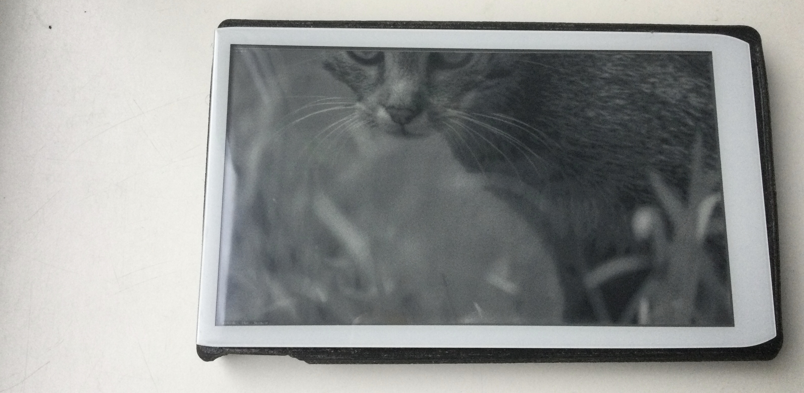

### Inkster example of JPEG decoding

This is an EPDiy /Inkster example for the Arduino ESP32 framework (>= 2.0.2)




```
Performance test using LilygoEPD47 as display:

60747 bytes read from https://loremflickr.com/960/540
I (12425) decode: 291 ms - 960x540 image MCUs:34
I (12425) www-dw: 322 ms - download
I (12425) render: 170 ms - render
I (14006) total: 783 ms - total time spent

```